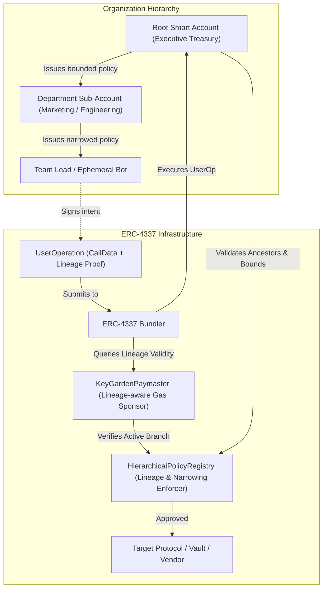

# ROAD TO DEVCON – IIITN EDITION

## KeyGarden

### Built At
Ethereum Research Workshop & Builders Lab  
**IIIT Nagpur × Bhaisaaab**

---

### Project Overview

**KeyGarden** is a **Hierarchical Account Abstraction Architecture** where an organization's root treasury smart account issues departmental sub-accounts, which in turn issue team-level or individual ephemeral bot accounts. Each node in the tree inherits and strictly narrows the permissions, spending limits, duration, and target contracts of its parent. 

Most importantly, **KeyGarden achieves O(1) Atomic Cascading Revocation**: revoking any intermediate branch node instantly and cryptographically disables that entire sub-tree across all downstream signers and sub-accounts in a single onchain transaction.

* **GitHub Repository**: [https://github.com/adiscripts03/KeyGarden](https://github.com/adiscripts03/KeyGarden)

---

### The Problem

In modern Ethereum organizations, DAOs, and crypto-native enterprises:
1. **Binary Key Management**: Traditional wallets (EOAs) and multi-sigs operate with flat, all-or-nothing key permissions. Giving an engineer, marketing manager, or AI automated agent transaction access requires either risking the entire treasury or deploying heavy, isolated multi-sigs with fragmented liquidity.
2. **Permission Creep & Stale Access**: When a contractor leaves, a sub-department restructures, or an API key leaks, admins must hunt down and revoke dozens of separate session keys and allowance approvals one by one. If one key is missed, the treasury remains exposed.
3. **Lack of Delegated Constraint Invariants**: Traditional session keys lack hierarchical containment. A department head cannot safely subdivide their own operational budget to junior teammates or automated bots with guaranteed narrower constraints.

---

### The Solution

KeyGarden introduces an onchain **Hierarchical Account & Session Tree Registry**:
* **Recursive Policy Inheritance**: Every sub-account is mathematically constrained by its lineage chain back to the Root Smart Account.
* **Strict Policy Narrowing**: A child sub-account cannot possess a larger spend limit, longer validity window, or broader target whitelist than its parent.
* **Atomic Cascading Revocation**: When a parent node is revoked, all downstream descendants become instantly invalid for execution and gas sponsorship because validation requires verifying that all ancestors in the lineage are active.
* **Gas-Sponsored Execution via ERC-4337 Paymaster**: Department sub-accounts and automated bots execute UserOperations with gas costs sponsored by the organization's Paymaster without holding raw native ETH.

---

### Why Account Abstraction?

Traditional EOAs cannot enforce cryptographic hierarchy, lineage traversal, or programmable spending bounds at the validation step. 

With **ERC-4337 Smart Accounts & Custom Validation Rules**:
1. **Programmable Authorization**: Signature verification does not simply check ECDSA recovery of an owner; it queries the `HierarchicalPolicyRegistry` to verify the signer's lineage, remaining budget, time bounds, and target whitelist.
2. **Unified Treasury Liquidity**: Sub-accounts don't need independent funded wallets; they draw bounded allocations directly from the parent Smart Account.
3. **Paymaster Gas Abstraction**: Ephemeral bots and junior members transact with zero upfront ETH friction while the Paymaster verifies their active hierarchical lineage before sponsoring gas.

---

### Key Features

* 🌳 **Visual Interactive Account Tree**: Real-time canvas representing the organizational account tree, lineage paths, spend telemetry, and active status.
* 🛡️ **Mathematical Policy Narrowing**: Automatic client and onchain validation ensuring children cannot exceed parent budget, transaction spend limits, expiry timestamps, or target contract permissions.
* ⚡ **O(1) Cascading Revocation (Branch Pruning)**: Revoking a department branch in 1 transaction cryptographically blocks all downstream signers.
* ⛽ **ERC-4337 Paymaster Sponsorship**: Sponsored transactions for active sub-accounts with instant paymaster cutoff when a branch is pruned.
* 🎭 **Live Multi-Persona Execution Console**: Switch seamlessly between Executive Owner, Marketing Admin, Growth Lead, and Social Ad Bot to test valid executions and observe policy rejection.
* 📜 **Real-time Cryptographic Audit Trail**: Full transaction logs detailing execution traces, selector decoding, gas sponsorship, and ancestor validation state.

---

### ERC-4337 / Smart Account Architecture



#### Architecture Components:
1. **`KeyGardenAccount.sol`**: ERC-4337 compliant Smart Account holding treasury assets and executing calls on behalf of authorized sub-account signers.
2. **`HierarchicalPolicyRegistry.sol`**: Core smart contract enforcing tree registration, recursive policy narrowing, lineage verification, and atomic subtree revocation.
3. **`KeyGardenPaymaster.sol`**: Gas sponsorship paymaster that inspects sub-account lineage status in the registry before validating UserOperations.
4. **`MockTargetServices.sol`**: Simulated onchain targets (Treasury Grants, Vendor Invoices, Social Campaigns) for live demo execution.

---

### User Flow

1. **Root Setup**: Organization deploys the `KeyGardenAccount` and registers the root treasury node in the registry.
2. **Department Issuance**: Executive signer issues a sub-account for the "Marketing Department" with a 5.0 ETH budget, 30-day expiry, and whitelisted vendor/campaign targets.
3. **Team Sub-Delegation**: Marketing Admin issues a sub-account for "Growth Lead" (2.0 ETH budget, 14 days), who then creates an ephemeral "Social Ad Bot" (0.5 ETH budget, 2 days, social target only).
4. **Autonomous Execution**: The Ad Bot signs a UserOp calling the social campaign contract. The Paymaster sponsors the gas, the registry verifies lineage, and the smart account executes the action.
5. **Branch Revocation**: If the Marketing Department is compromised or restructured, the Root signer revokes Marketing in a single transaction. Instantly, Marketing, Growth Lead, and the Ad Bot are all disabled.

---

### Tech Stack

* **Frontend**: Next.js 14 (App Router), React 18, TypeScript, Tailwind CSS, Framer Motion, Lucide Icons, Canvas Confetti.
* **Ethereum & Smart Accounts**: Solidity (v0.8.24), Hardhat, Viem, Ethers.js v6.
* **Account Abstraction**: ERC-4337 UserOperation validation, Custom Lineage-Aware Paymaster, Smart Account execution dispatch.

---

### Project Structure

```
KeyGarden/
├── contracts/                        # Solidity Smart Contracts
│   ├── HierarchicalPolicyRegistry.sol # Core hierarchy & narrowing registry
│   ├── KeyGardenAccount.sol          # ERC-4337 Smart Account
│   ├── KeyGardenPaymaster.sol        # Lineage-aware gas paymaster
│   └── MockTargetService.sol         # Demo targets (Treasury, Vendor, Social)
├── test/
│   └── KeyGarden.test.cjs            # Hardhat test suite
├── scripts/
│   └── deploy.cjs                    # Deployment script
├── src/
│   ├── app/                          # Next.js App Router (Layout & Page)
│   ├── components/                   # Interactive UI Components
│   │   ├── Navbar.tsx                # Header with network & wallet state
│   │   ├── TreeVisualizer.tsx        # Interactive SVG/Card tree canvas
│   │   ├── NodeDetailPanel.tsx       # Lineage inspector & node telemetry
│   │   ├── ExecutionConsole.tsx      # Multi-persona transaction simulator
│   │   ├── PolicyBuilderModal.tsx    # Sub-account creation with narrowing rules
│   │   ├── BranchPruneModal.tsx      # Atomic branch revocation confirmation
│   │   ├── ActivityLog.tsx           # Cryptographic audit logs
│   │   └── InteractiveTour.tsx       # Guided onboarding tour
│   ├── context/
│   │   └── GardenContext.tsx         # Global application & tree state provider
│   ├── lib/
│   │   ├── garden-engine.ts          # Lineage engine & validation algorithms
│   │   └── constants.ts              # Demo personas, contracts, and targets
│   └── types/
│       └── garden.ts                 # TypeScript type definitions
├── hardhat.config.cjs                # Hardhat network & compiler configuration
└── package.json
```

---

### Getting Started

#### Prerequisites
* Node.js 18+ and npm installed

#### 1. Clone & Install
```bash
git clone https://github.com/adiscripts03/KeyGarden.git
cd KeyGarden
npm install
```

#### 2. Configure Environment (Optional for live Sepolia)
```bash
cp .env.example .env.local
```

#### 3. Run Contract Test Suite
```bash
npm run test:contracts
```
All 6 core hierarchical verification tests will run and pass:
* Parent-child sub-account issuance
* Policy narrowing enforcement (budget & target constraints)
* Level 3 execution within narrowed bounds
* Boundary violation rejection
* **Atomic cascading branch revocation**

#### 4. Run Development Server
```bash
npm run dev
```
Open [http://localhost:3000](http://localhost:3000) in your browser.

---

### Smart Contracts

| Contract Name | Purpose | EVM Target |
|---|---|---|
| `HierarchicalPolicyRegistry` | Enforces hierarchical policy tree, narrowing invariants, and cascading revocation | Paris (0.8.24) |
| `KeyGardenAccount` | ERC-4337 Smart Account with lineage validation dispatch | Paris (0.8.24) |
| `KeyGardenPaymaster` | Gas sponsorship verifying active tree lineage before approval | Paris (0.8.24) |
| `MockTreasuryVault` | Target contract for grant disbursements and token staking | Paris (0.8.24) |
| `MockVendorContract` | Target contract for vendor invoice payments | Paris (0.8.24) |
| `MockSocialCampaign` | Target contract for automated social campaign broadcasts | Paris (0.8.24) |

To deploy to Sepolia:
```bash
SEPOLIA_RPC_URL="https://sepolia.infura.io/v3/YOUR_KEY" PRIVATE_KEY="0x..." npx hardhat --config hardhat.config.cjs run scripts/deploy.cjs --network sepolia
```

---

### Account Abstraction Features

1. **Hierarchical Programmable Delegation**: Smart account permissions are not flat keys; they are nodes in a verifiable authorization DAG.
2. **Lineage-Aware ERC-4337 Paymaster**: The Paymaster checks `isNodeActive(nodeId)` directly against the registry before sponsoring gas, preventing revoked sub-accounts from draining paymaster funds.
3. **Session Key Sub-Delegation with Narrowing**: Sub-accounts can generate ephemeral session keys without interacting with the root owner, provided the parameters stay strictly within their own assigned envelope.

---

### Demo Script (Step-by-Step)

1. **Explore the Tree**: Click on the **Marketing Department** node. Observe its allocated 5.0 ETH budget, allowed targets, and child nodes (Growth Lead and Social Ad Bot).
2. **Switch Persona to Social Ad Bot**: Click "Select as Active Persona" or use the persona switcher in the Execution Console.
3. **Execute Valid Action**: Select target `MockSocialCampaign.broadcastCampaign` and click **"Execute via Smart Account"**. Notice:
   - Transaction succeeds.
   - Gas is sponsored 100% by the Paymaster.
   - Upstream cumulative budgets are deducted atomically.
4. **Trigger Policy Violation**: Try calling `MockVendorContract` from the Ad Bot. The system immediately rejects the transaction with `TargetNotAllowed` because the parent did not pass this target permission to the bot.
5. **Prune the Branch**: Select the Marketing Department and click **"Prune Branch (Revoke)"**. Confirm the transaction.
6. **Observe Cascading Revocation**: The Marketing Department, Growth Lead, and Social Ad Bot are all marked as **Pruned/Revoked**. Trying to execute any action from the Ad Bot now fails with `AncestorIsRevoked`.

---

### Security Considerations

* **Upstream Lineage Traversal Gas**: Lineage validation traverses from leaf node to root. In production, tree depth can be capped at 5–8 levels to keep verification gas minimal and predictable.
* **Onchain State Synchronization**: In full deployment, subtree revocation marks the target node's `isRevoked = true`. Descendant checks dynamically evaluate ancestor state, making revocation strictly O(1) in write gas cost.
* **Key Expiry Guarantees**: Time expirations are enforced using `block.timestamp` against `validUntil` and `validAfter` bounds.

---

### Privacy Considerations

KeyGarden focuses on **authorization hierarchy and permission abstraction**. Tree nodes, public keys, and spending bounds are public onchain state. For enterprise confidentiality, future iterations can implement zero-knowledge membership proofs (e.g., Merkle tree of active delegations with zk-SNARK proof of lineage) to obscure internal organizational structure.

---

### Built During

**ROAD TO DEVCON – IIITN EDITION**  
Ethereum Research Workshop & Builders Lab  
**IIIT Nagpur × Bhaisaaab**
